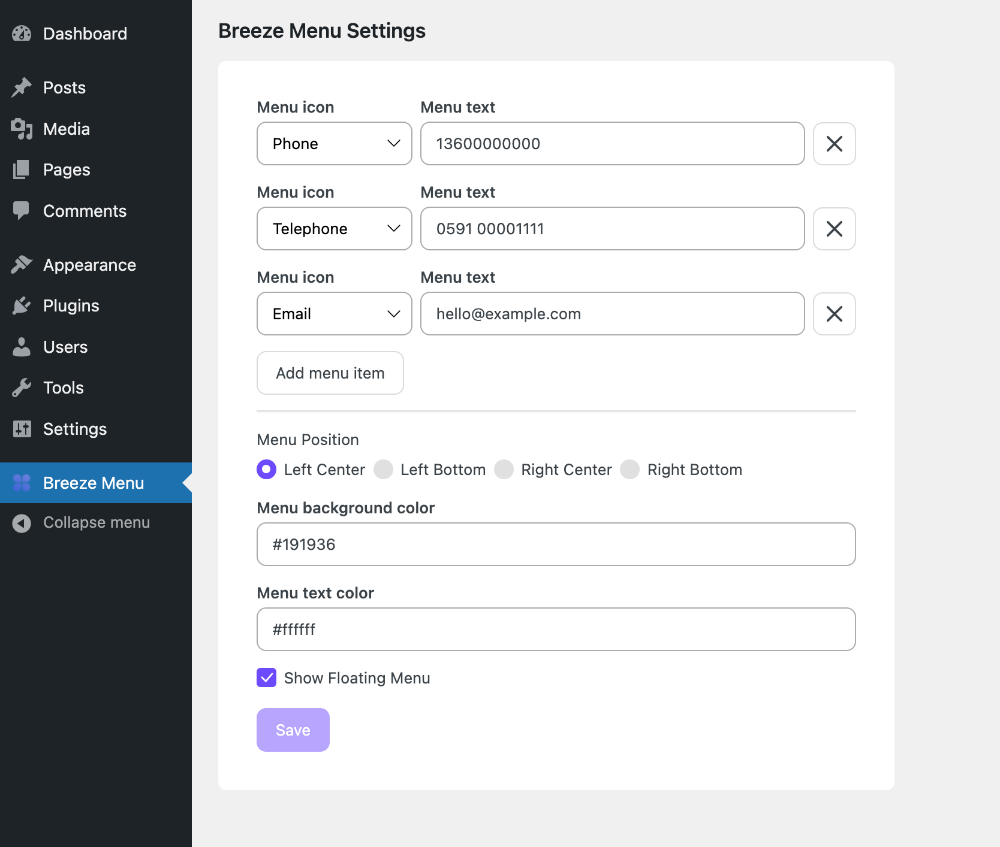

# Breeze Menu

A tiny WordPress plugin to display a simple floating menu on frontend. Admin/Frontend UI built with web components from https://github.com/heybran/cucumber-components

> This plugin was submitted to WordPress.org on September 3, 2023 and not yet reviewed, the current wait for an initial review is at least 72 days after submission date.

## Admin

## Frontend

